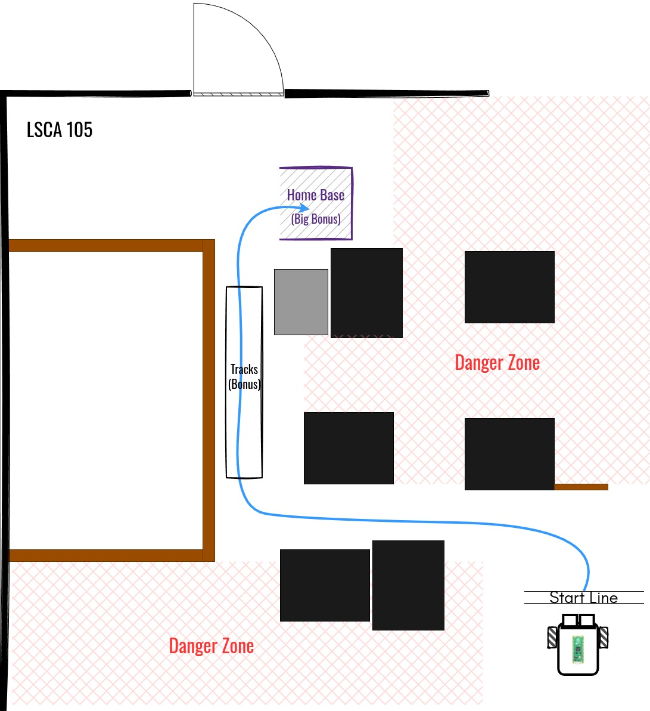

# Lab Rover

## Background Story

On the surface of the planet LSC-001e, our brave rover R1B has successfully secured a volatile sample of "Element M2-5", a crucial resource to build planetary engines.
Now begins the perilous return journey to the Base Station, a navigation challenge that would fry the circuits of lesser bots.
R1B must traverse the extraterrestrial terrain, relying on its sensors to differentiate between solid ground and deceptively steep cliffs.
The good news is, on the way to the sampling site, R1B memorized the surrounding environment and made a map.
R1B shared this information to its trustworthy human partner, you, and is waiting on a reliable plan to start the journey back home.

## Autonomous Navigation Procedure

1. Set the robot behind the "Start Line" and receive the payload ("Element M2-5").
2. Initialization and self-check.
3. Start autonomous navigation (can be manually activated).
4. Avoid the "Danger Zones", and finish inside (or as close as possible to) the "Home Base".
5. Indicate the autonomous navigation is finished (red light).

> [!CAUTION]
>
> - Human intervention will terminate the navigation after the robot crossed over the "Start Line".
> - Entering the "Danger Zones" will terminate the navigation.
> - The distance between the navigation ending location and the "Home Base" will be the dominating metric to evaluate the quality of the navigation.
See [coding requirements](#5-60-coding) below for more details.
> - Traveling in-between the "Tracks" is highly recommended (5% bonus if the robot can do so).
> - Finish the autonomous navigation inside of "Home Base" will result in 30% **bonus** points.

## Requirements

- Complete [Documentation](#documentation) and describe your designs.
- Upload your robot controlling scripts to this repository.

### 1. (15%) Mechanical Design

- (7%) Technical drawing of the robot base.
- (3%) Technical drawing of the motor bracket.
- (3%) Technical drawing of the driving wheel.
- (2%) Technical drawing of the caster wheel.

### 2. (10%) Electrical Design

- (7%) Diagram of signal wire connections in-between Pico, motor driver, motors, encoders, distance sensors and other sensors.
- (3%) Wiring diagram for all electrical components.

> [!TIP]
>
> - You can use one diagram for all.

### 3. (10%) Software Design

- Describe the control logic of the navigation using a list of steps, or a [algorithm table](https://i.sstatic.net/6hfCG.png), or a [flowchart](https://upload.wikimedia.org/wikipedia/commons/thumb/9/91/LampFlowchart.svg/960px-LampFlowchart.svg.png).

### 4. (5%) Broader Impact

- (2%) Please briefly state the future or possible applications of this robot.
- (3%) Please discuss broader impacts of this robot with consideration of public health, safety, and welfare, as well as global, cultural, social, environmental, and economic factors.

### 5. (60%) Coding

- (5%) Initialize the robot by checking all the sensors and actuators are functional.
- (10%) While your robot is running, use **green** LED's brightness to indicate distance sensor's detection.
- (10%) Regulate your robot's behavior by proposing reference linear and angular velocities **only** (not required for initialization).
- (5%) Light up **red** LED and keep it on after the navigation is done.
- (30%) Navigation code.

> [!IMPORTANT]
>
> - Use the RGB LED on the board to indicate the functionality of the components.
> - **ONLY** (initialization is exceptional) `set_vels()` from [diff_drive_controller.py](https://github.com/linzhangUCA/r1b_control/blob/main/upython_scripts/diff_drive_controller.py) or an equivalent function is allowed to drive the robot.
> - If the robot failed to finish the navigation inside of the "Home Base", and $d$ (in meters) is the distance between the navigation ending location and the "Home Base". $30% \times d / 15 $ points will be taken off.
> - If the robot finished inside of the "Home Base", 30% **bonus** points will be given.

## Documentation
>
> Please refer to Github's [Basic writing and formatting syntax](https://docs.github.com/en/get-started/writing-on-github/getting-started-with-writing-and-formatting-on-github/basic-writing-and-formatting-syntax).

### Mechanical Designs

#### Base Tech Draw

#### Motor Bracket Tech Draw

#### Driving Wheel Tech Draw

#### Caster Wheel Tech Draw

### Electrical Designs

### Software Designs

### Broader Impact
